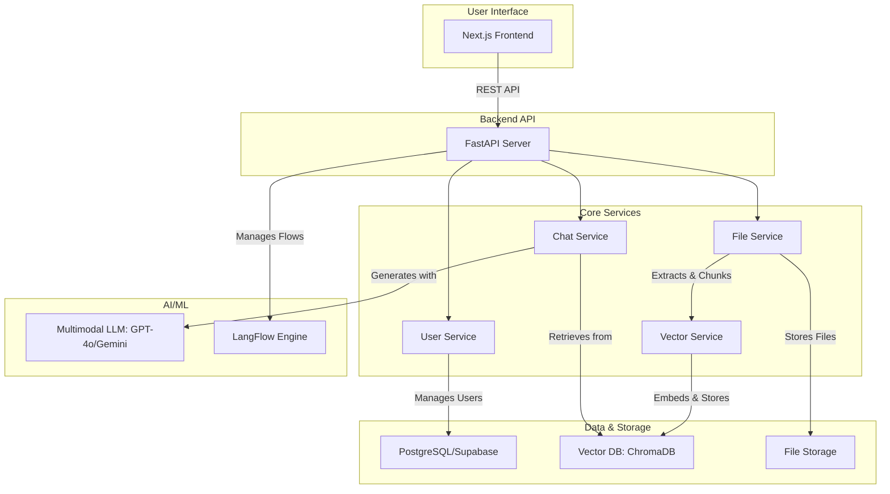

# LangFlow - AI-Powered Knowledge Management System

[](https://www.python.org)
[](https://fastapi.tiangolo.com/)
[](https://nextjs.org/)
[](https://www.typescriptlang.org/)
[](https://opensource.org/licenses/MIT)

사내 문서와 지식 자산을 활용하여 답변하는 AI 어시스턴트 플랫폼입니다. LangFlow를 기반으로 RAG(Retrieval-Augmented Generation) 파이프라인을 구축하고, 사용자가 쉽게 문서를 업로드하고 지능적인 답변을 얻을 수 있는 환경을 제공합니다.

---

## 목차

- [주요 기능](#-주요-기능)
- [시스템-아키텍처](#-시스템-아키텍처)
- [기술-스택](#-기술-스택)
- [프로젝트-구조](#-프로젝트-구조)
- [설치-및-실행](#-설치-및-실행)
- [API-엔드포인트](#-주요-api-엔드포인트)
- [기여-방법](#-기여-방법)
- [라이선스](#-라이선스)

## ✨ 주요 기능

- **📄 문서 관리**: PDF, TXT 등 다양한 형식의 문서를 업로드하고 관리합니다.
- **🧠 지능형 RAG 파이프라인**:
  - 업로드된 문서는 자동으로 텍스트, 이미지, 표 등으로 분석 및 분할됩니다.
  - 멀티모달 임베딩 모델을 통해 각 정보 조각을 벡터화하여 데이터베이스에 저장합니다.
- **💬 AI 채팅**: 문서 내용을 기반으로 자연스러운 질의응답을 제공하며, 답변의 근거가 되는 소스(텍스트, 이미지)를 함께 제시합니다.
- **⚙️ Flow 관리**: LangFlow UI 또는 API를 통해 RAG 파이프라인을 시각적으로 설계하고 수정할 수 있습니다.
- **👥 사용자 관리**: 역할 기반의 사용자 인증 및 접근 제어 기능을 제공합니다.
- **📊 대시보드**: 시스템 사용 현황과 통계를 시각적으로 모니터링합니다.

## 🏗️ 시스템 아키텍처



## 🛠️ 기술 스택

| 구분        | 기술                               | 역할                                     |
| ----------- | ---------------------------------- | ---------------------------------------- |
| **Frontend**| `Next.js` / `React`                | 사용자 인터페이스 구축                   |
|             | `TypeScript`                       | 타입 안정성 확보                         |
|             | `Tailwind CSS` / `shadcn/ui`       | 모던하고 반응형인 UI 디자인              |
| **Backend** | `Python` / `FastAPI`               | 고성능 REST API 서버 구축                |
|             | `Pydantic`                         | 엄격한 데이터 유효성 검사                |
|             | `SQLModel` / `SQLAlchemy`          | 데이터베이스 ORM                         |
| **AI/ML**   | `LangFlow` / `LangChain`           | RAG 파이프라인 설계 및 오케스트레이션    |
|             | `OpenAI GPT-4o` / `Google Gemini`  | 멀티모달 LLM (생성 및 임베딩)            |
| **Database**| `PostgreSQL` (Supabase)            | 사용자 정보, 메타데이터 등 관계형 데이터 저장 |
|             | `ChromaDB`                         | 텍스트/이미지 벡터 데이터 저장 및 검색   |
| **DevOps**  | `uv`                               | Python 패키지 및 가상환경 관리           |
|             | `Docker`                           | 컨테이너화 및 배포 자동화 (예정)         |

## 📂 프로젝트 구조

```
.
├── backend/            # Python FastAPI 백엔드
│   ├── app/            # 핵심 애플리케이션 로직
│   ├── data/           # 업로드 파일, 로그, 벡터 DB 저장
│   ├── langflow/       # LangFlow 파이프라인 정의
│   ├── main.py         # FastAPI 앱 진입점
│   └── pyproject.toml  # Python 프로젝트 설정 및 의존성 (uv)
├── frontend/           # Next.js 프론트엔드
│   ├── app/            # Next.js App Router 페이지
│   ├── components/     # 재사용 가능한 React 컴포넌트
│   ├── lib/            # 유틸리티 및 API 클라이언트
│   └── package.json    # Node.js 의존성
└── README.md
```

## 🚀 설치 및 실행

### 사전 요구사항

- [Python 3.11+](https://www.python.org/)
- [Node.js 18+](https://nodejs.org/)
- [uv](https://github.com/astral-sh/uv) (Python 패키지 관리자)

### 1. 저장소 복제

```bash
git clone https://github.com/your-username/LangFlow.git
cd LangFlow
```

### 2. 환경 변수 설정

각 `backend` 및 `frontend` 디렉토리의 `.env.example` 파일을 복사하여 `.env` (백엔드) 및 `.env.local` (프론트엔드) 파일을 생성하고, API 키 및 데이터베이스 정보를 입력합니다.

```bash
# Backend
cp backend/.env.example backend/.env

# Frontend
cp frontend/.env.example frontend/.env.local
```

### 3. 백엔드 실행

```bash
cd backend

# 가상환경 생성 및 활성화
uv venv
source .venv/bin/activate  # macOS/Linux
# .venv\Scripts\activate  # Windows

# 의존성 설치
uv pip install -r requirements.txt

# 서버 실행 (개발 모드)
uvicorn app.main:app --reload --host 0.0.0.0 --port 8000
```

### 4. 프론트엔드 실행

(별도의 터미널에서 진행)

```bash
cd frontend

# 의존성 설치
npm install

# 개발 서버 실행
npm run dev
```

이제 브라우저에서 `http://localhost:3000`으로 접속하여 애플리케이션을 확인할 수 있습니다.

## 🌐 주요 API 엔드포인트

- `POST /api/v1/users/signup`: 사용자 회원가입
- `POST /api/v1/users/login`: 사용자 로그인
- `POST /api/v1/files/upload`: 문서 파일 업로드
- `GET /api/v1/files`: 업로드된 파일 목록 조회
- `POST /api/v1/chat/stream`: AI와 스트리밍 채팅
- `GET /api/v1/flows`: 저장된 LangFlow 파이프라인 목록 조회

## 🤝 기여 방법

기여를 환영합니다! 버그를 발견하거나 새로운 기능을 제안하고 싶다면 언제든지 이슈를 등록해주세요. 직접 코드 기여를 원하시면 다음 절차를 따라주세요.

1.  이 저장소를 Fork 하세요.
2.  새로운 기능 브랜치를 생성하세요 (`git checkout -b feature/AmazingFeature`).
3.  변경 사항을 커밋하세요 (`git commit -m 'Add some AmazingFeature'`).
4.  브랜치에 푸시하세요 (`git push origin feature/AmazingFeature`).
5.  Pull Request를 열어주세요.

## 📄 라이선스

이 프로젝트는 [MIT License](LICENSE)에 따라 배포됩니다.